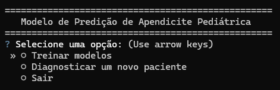
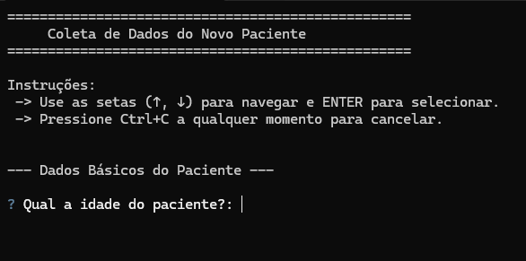

# 🩺 Sistema de Apoio ao Diagnóstico de Apendicite Pediátrica

> Um sistema de linha de comando (CLI) interativo para auxiliar no diagnóstico de apendicite pediátrica utilizando modelos de Machine Learning.

Este projeto utiliza o dataset [Regensburg Pediatric Appendicitis](https://archive.ics.uci.edu/dataset/938/regensburg+pediatric+appendicitis) para treinar modelos de classificação capazes de prever o **diagnóstico**, a **gravidade** e o **tratamento clínico** sugerido para um paciente com suspeita de apendicite.

## Objetivo

O principal objetivo deste projeto é criar uma ferramenta de apoio à decisão clínica que seja rápida e fácil de usar. Através de um formulário interativo, profissionais de saúde podem inserir os dados de um paciente e receber em segundos uma predição baseada em modelos treinados com centenas de casos, auxiliando no processo de diagnóstico diferencial.

## Funcionalidades

- **Coleta de Dados Interativa:** Um formulário amigável no terminal, guiado por seções, para inserção de dados do paciente.
- **Predição Múltipla:** O sistema fornece predições para alvos cruciais, como diagnóstico, gravidade e manejo.
- **Pipeline Automatizado:** Inclui scripts para download do dataset, pré-processamento, normalização, balanceamento de dados e treinamento dos modelos.
- **Lógica Condicional:** O formulário adapta as perguntas com base nas respostas (ex: perguntas sobre ultrassom só aparecem se o exame foi realizado).
- **Interface em Português:** Todas as interações com o usuário são claras e em português.

## Tecnologias Utilizadas

- **Python 3.10+**
- **Pandas:** Para manipulação e análise de dados.
- **Scikit-learn:** Para criação, treinamento e avaliação dos modelos de Machine Learning (`RandomForestClassifier`, `GridSearchCV`, etc.).
- **imbalanced-learn:** Para técnicas de balanceamento de dados (ex: SMOTE).
- **Questionary:** Para a criação da interface de linha de comando interativa.
- **ucimlrepo:** Para o download automatizado do dataset.

## Instalação e Configuração

Siga os passos abaixo para configurar o ambiente e rodar o projeto.

**1. Clone o Repositório**
```bash
git clone [https://github.com/seu-usuario/seu-repositorio.git](https://github.com/seu-usuario/seu-repositorio.git)
cd seu-repositorio
```

**2. Crie e Ative um Ambiente Virtual**
```bash
python -m venv .venv
```

**3. Ative o Ambiente Virtual**
- No Windows:
```bash
.\.venv\Scripts\activate
```

- no macOS / Linux:
```bash
source .venv/bin/activate
```

**3. Instale as Dependências**

```bash
pip install -r requirements.txt
```

**4. Execute o Programa Principal**
```bash
python src\main.py
```

# Como Usar
Com o ambiente configurado e as dependências instaladas, você pode executar o programa.

**1. Rodar o Programa Principal**

- Execute o script principal para iniciar o menu interativo.

**2. Navegue pelo Menu**

- O menu principal aparecerá, permitindo que você escolha entre "Treinar modelos", "Diagnosticar um novo paciente" e "Sair".
<div style="display: flex; justify-content: center; align-items: center;">
    
</div>

- Use as setas para navegar e ENTER para selecionar.
- Preencha os dados do paciente conforme solicitado.

<div style="display: flex; justify-content: center; align-items: center;">
    
</div>

- Ao final, o sistema exibirá os resultados da predição e os resultados do paciente será salvo em pacientes_inferidos.csv

# Estrutura
```bash
Pediatric_Appendicitis_ML_Model/
│
├── data/
│   └── pacientes_inferidos.csv # Dados e resultados de todos os pacientes consultados
│
├── models/                     # Modelos treinados
│   ├── modelo_normalizador.pkl
│   ├── pediactric_appendicitis_Diagnosis_model.pkl
│   ├── pediactric_appendicitis_Management_model.pkl
│   └── pediactric_appendicitis_Severity_model.pkl
│
├── src/
│   ├── app/
│   │   ├── __init__.py 
│   │   ├── inference.py        # Funções para inferência
│   │   ├── menu.py             # Funções para menu
│   │   └── patient_intake.py   # Funções para coleta de dados do paciente
│   │
│   ├── data_pipeline/
│   │   ├── __init__.py
│   │   ├── balancing.py        # Funções para balancear os dados
│   │   ├── normalization.py    # Funções de normalização e scalers
│   │   └── processing.py       # Funções de pré-processamento
│   │      
│   ├── data_pipeline/
│   │   ├── __init__.py
│   │   └── train.py            # Funções para treinamento dos modelos
│   │
│   ├── __init__.py             
│   └── main.py                 # Programa principal
│
└── requirements.txt            # Lista de dependências
```